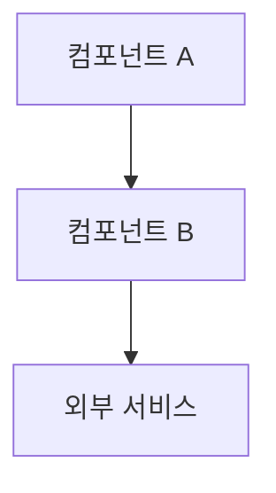
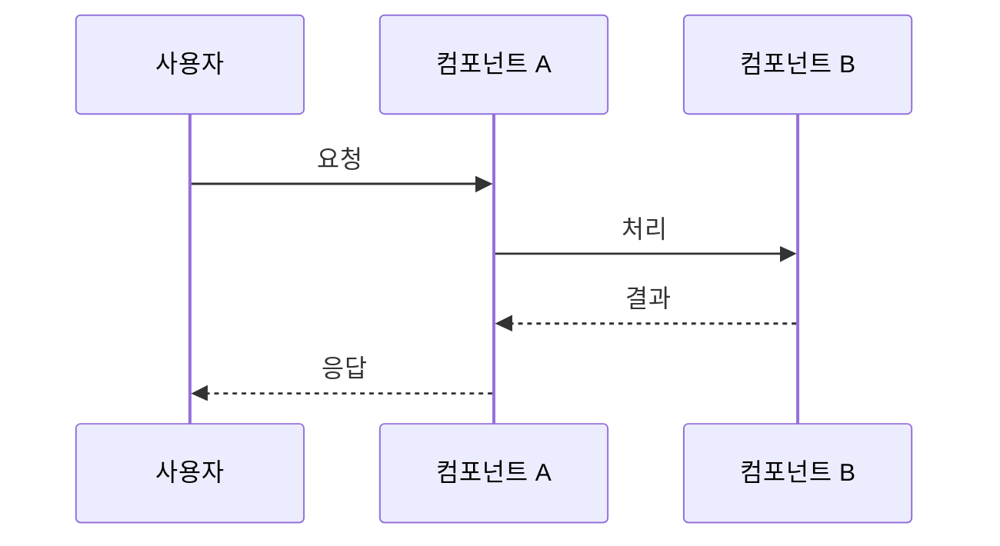

# 설계: {{FEATURE_NAME}}

<!-- AI 작성 지침:
  - 아키텍처와 인터페이스만 — 구현 코드 없음
  - 코드 예시 없음 (타입/인터페이스 계약은 허용)
  - 복잡한 흐름은 Mermaid 다이어그램
  - design-gen.md 스킬 참조
-->

## 개요
<!-- 이 설계가 해결하는 것과 핵심 접근법 -->

## 아키텍처

### 시스템 경계
<!-- 외부 시스템, 사용자, 데이터 소스와의 경계 -->

### 주요 컴포넌트
<!-- 각 컴포넌트의 역할과 책임 -->

## 컴포넌트 상세

### [컴포넌트명]
- **역할**: [단일 책임]
- **입력**: [받는 것]
- **출력**: [반환하는 것]
- **의존성**: [필요한 것]

## 데이터 모델

### [엔티티명]
| 필드 | 타입 | 설명 | 제약 |
|------|------|------|------|
| id   | string | 고유 식별자 | 필수 |

## API 계약

### [엔드포인트 또는 인터페이스명]
- **입력**: [타입과 제약]
- **출력**: [타입과 가능한 상태]
- **오류**: [오류 조건]

## 흐름 다이어그램

## 기술 결정
| 결정 | 선택 | 이유 | 대안 |
|------|------|------|------|
| [항목] | [선택한 것] | [이유] | [고려했으나 제외] |
