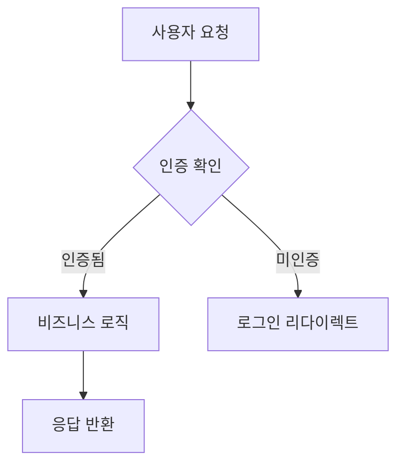
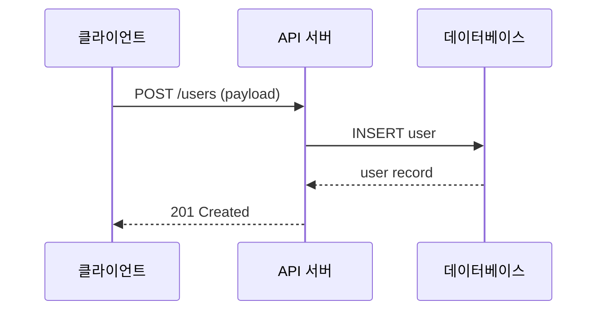
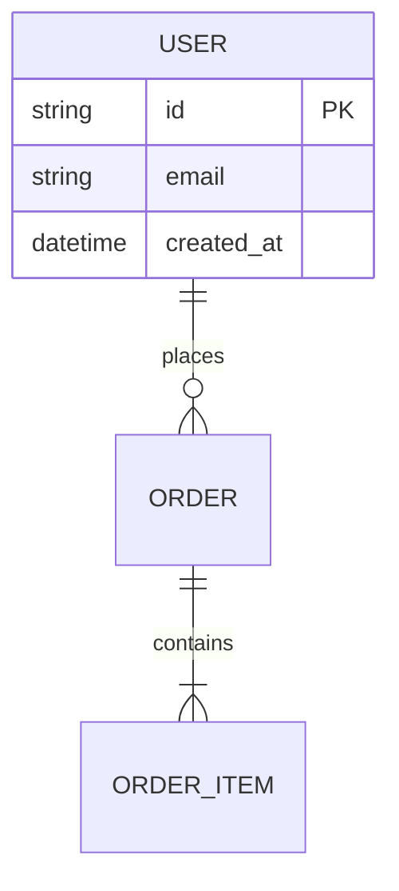

# 설계 패턴 및 인터페이스 형식

## 인터페이스 계약 형식

각 인터페이스에 포함할 내용:

```
### [컴포넌트명] 인터페이스

**입력**:
- `paramName`: 타입 — 설명, 필수/선택, 제약

**출력**:
- 성공: 타입 — 설명
- 실패: 오류 타입 — 조건

**오류 조건**:
- `ERROR_CODE`: 발생 조건
```

## 컴포넌트 설계 원칙

### 단일 책임
- 컴포넌트 1개 = 책임 1개
- "그리고"가 들어가면 분리 신호

### 의존성 방향
- 상위 → 하위 (단방향)
- 순환 의존 발견 시: 인터페이스 추상화로 해결

### 경계 정의
```
[외부 사용자/시스템]
    ↓
[API/인터페이스 계층]
    ↓
[비즈니스 로직 계층]
    ↓
[데이터 접근 계층]
    ↓
[외부 서비스/DB]
```

## 아키텍처 패턴별 설계 지침

### Feature-First 구조
```
src/
  features/
    auth/
      - 요청 처리
      - 비즈니스 로직
      - 데이터 접근
    dashboard/
      ...
  shared/
    - 공통 유틸리티
    - 공통 타입
```

### Layered Architecture
```
presentation/   ← UI, API 핸들러
    ↓
application/    ← 비즈니스 유스케이스
    ↓
domain/         ← 비즈니스 엔티티, 규칙
    ↓
infrastructure/ ← DB, 외부 서비스
```

## 데이터 모델 형식

```markdown
### [엔티티명]
| 필드 | 타입 | 설명 | 제약 |
|------|------|------|------|
| id   | string | 고유 식별자 | 필수, UUID |
| name | string | 표시 이름 | 필수, ≤255자 |
| created_at | datetime | 생성 시각 | 자동 설정 |
```

## Mermaid 예시

### flowchart


### sequenceDiagram


### erDiagram


## 외부 의존성 조사 체크리스트

WebSearch 사용 시 확인:
- [ ] API 스펙 최신 버전
- [ ] 라이브러리 최신 안정 버전
- [ ] 보안 취약점 공지
- [ ] 라이선스 호환성
- [ ] 요금/제한 (무료 티어 등)
