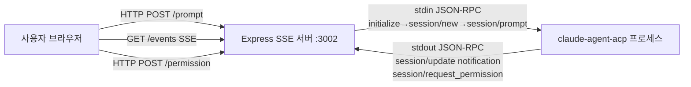
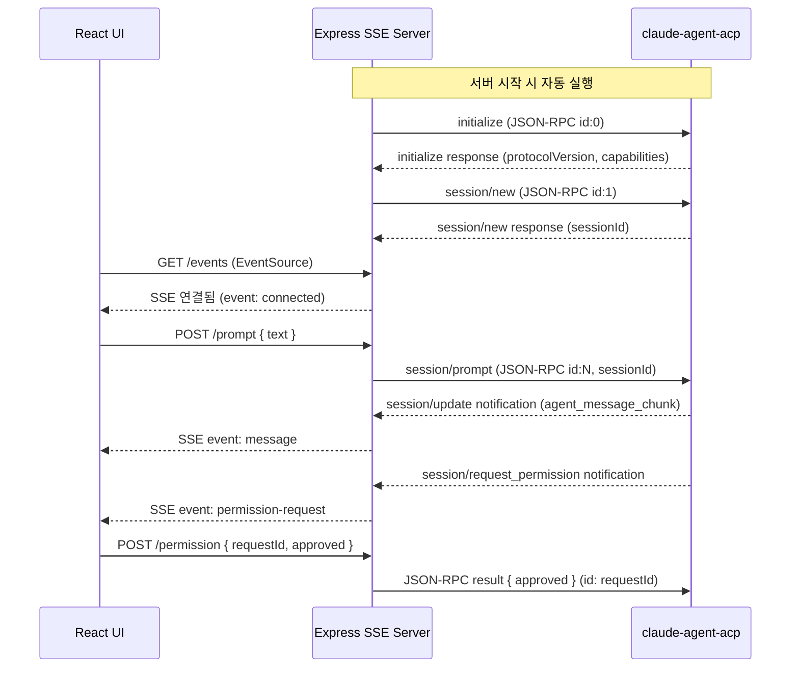

# Design: cline-acp-sse-v2

> 참조: references/acp-protocol.md (ACP JSON-RPC 공식 스펙)
> 참조: references/sse-format.md (SSE 이벤트 스트림 공식 스펙)

## 시스템 경계



## 컴포넌트

### agent (Node.js + TypeScript, Express)

#### bridge.ts

- 역할: ACP 에이전트 프로세스 lifecycle 관리 + JSON-RPC 통신 (올바른 ACP 핸드셰이크 포함)
- 책임: spawn/kill, 초기화 핸드셰이크, stdin 쓰기, stdout 파싱, 이벤트 emit

> 참조: references/acp-protocol.md — ACP 핸드셰이크 순서, 올바른 method 이름

**인터페이스:**

```typescript
class ACPBridge extends EventEmitter {
  start(): void          // 에이전트 spawn + initialize + session/new
  stop(): void           // 에이전트 kill
  sendPrompt(text: string): void       // session/prompt 전송
  sendPermission(requestId: string, approved: boolean): void  // 권한 응답
  isRunning(): boolean
  hasPendingPermission(requestId: string): boolean
}
```

**Events emitted:**
- `message` — `{ id, role: 'agent', content, timestamp }`
- `toolcall` — `{ id, name, params, status, timestamp }`
- `permission-request` — `{ requestId, description, tool }`
- `error` — `{ message }`
- `exit` — `{ code }`
- `started` — 에이전트 spawn 완료
- `log` — `{ level, message }` (디버그 로그)

**ACP 핸드셰이크 순서 (start() 내부):**
1. 프로세스 spawn
2. stdout에서 응답 수신 준비
3. `initialize` 요청 전송 (id: 0)
4. `initialize` 응답 수신 후 → `session/new` 요청 전송 (id: 1)
5. `session/new` 응답에서 sessionId 획득
6. 이후 `sendPrompt()` 호출 시 `session/prompt` (id: 증가)

**메시지 파싱 (올바른 ACP method 이름):**

| 수신 메시지 | 처리 방법 |
|-----------|---------|
| `method: "session/update"` + `update.sessionUpdate: "agent_message_chunk"` | `message` 이벤트 emit |
| `method: "session/update"` + `update.sessionUpdate: "tool_call"` | `toolcall` 이벤트 emit |
| `method: "session/request_permission"` | `permission-request` 이벤트 emit |
| `id === 0` (initialize 응답) | 세션 초기화 계속 |
| `id === 1` (session/new 응답) | sessionId 저장 |
| `error` 필드 있음 | `error` 이벤트 emit |

**권한 응답 형식:**

```json
{
  "jsonrpc": "2.0",
  "id": "[requestId]",
  "result": { "approved": true }
}
```
> ⚠️ v1과 달리 `method: "permission"` 아님. id = requestId, result = { approved }

#### server.ts

- 역할: Express HTTP 서버, SSE 스트림, REST 엔드포인트
- 책임: 클라이언트 연결 관리, SSE 브로드캐스트, keepalive

> 참조: references/sse-format.md — 올바른 SSE 이벤트 형식

**인터페이스:**
- `GET /events` → SSE stream (Content-Type: text/event-stream)
- `POST /prompt` → `{ text: string }` → 200/400/503
- `POST /permission` → `{ approved: boolean, requestId: string }` → 200/400/404
- `GET /health` → `{ status: "ok", agentRunning: boolean }`

**SSE 이벤트 형식:**

```
event: [type]\n
data: [JSON]\n
\n
```

타입 목록: `message`, `toolcall`, `permission-request`, `keepalive`, `error`

**브로드캐스트 로직:**
- 연결된 모든 클라이언트에 동시 전송
- 클라이언트 disconnect 시 목록에서 제거 + keepalive 타이머 정리

### ui (React 19 + Vite, 포트 5174)

#### useChat.ts (hook)

- 역할: SSE 연결 및 서버 통신 상태 관리
- 책임: EventSource 연결, fetch POST, 상태 관리

**인터페이스:**

```typescript
function useChat(): {
  messages: Message[];
  toolCalls: ToolCall[];
  permissionRequest: PermissionRequest | null;
  connected: boolean;
  sendPrompt(text: string): Promise<void>;
  respondPermission(requestId: string, approved: boolean): Promise<void>;
}
```

#### 컴포넌트

| 컴포넌트 | 파일 | 역할 |
|---------|------|------|
| `MessageList` | `src/components/MessageList.tsx` | 채팅 메시지 목록 렌더링 |
| `ChatPanel` | `src/components/ChatPanel.tsx` | 입력창 + 연결 상태 표시 |
| `PermissionDialog` | `src/components/PermissionDialog.tsx` | 모달 권한 승인 다이얼로그 |
| `ToolCallLog` | `src/components/ToolCallLog.tsx` | 툴콜 로그 표시 |

## 데이터 모델

```typescript
type Message = {
  id: string;
  role: "user" | "agent";
  content: string;
  timestamp: number;
}

type ToolCall = {
  id: string;
  name: string;
  params: Record<string, unknown>;
  status: "requested" | "in_progress" | "completed";
  timestamp: number;
}

type PermissionRequest = {
  requestId: string;
  description: string;
  tool: string;
}
```

## 시퀀스 다이어그램



## 기술 결정

| 결정 | 선택 | 이유 |
|------|------|------|
| 실시간 통신 | SSE (EventSource) | 단방향 스트리밍에 최적, 자동 재연결, 방화벽 친화적 |
| 에이전트 통신 | stdio JSON-RPC (ACP 공식 스펙 준수) | ACP 공식 프로토콜, 핸드셰이크 포함 |
| 빌드 도구 | Vite | React 19 + TypeScript 빠른 HMR |
| 컨테이너 | Docker Compose | 두 서비스 동시 관리 |

## 의존성 방향

```
UI → Server (HTTP/SSE)
Server → ACPBridge (함수 호출)
ACPBridge → claude-agent-acp (stdio JSON-RPC, ACP 프로토콜)
```
