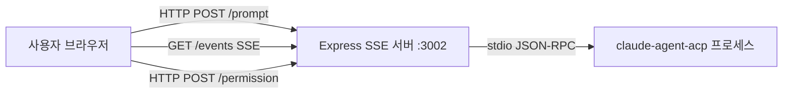
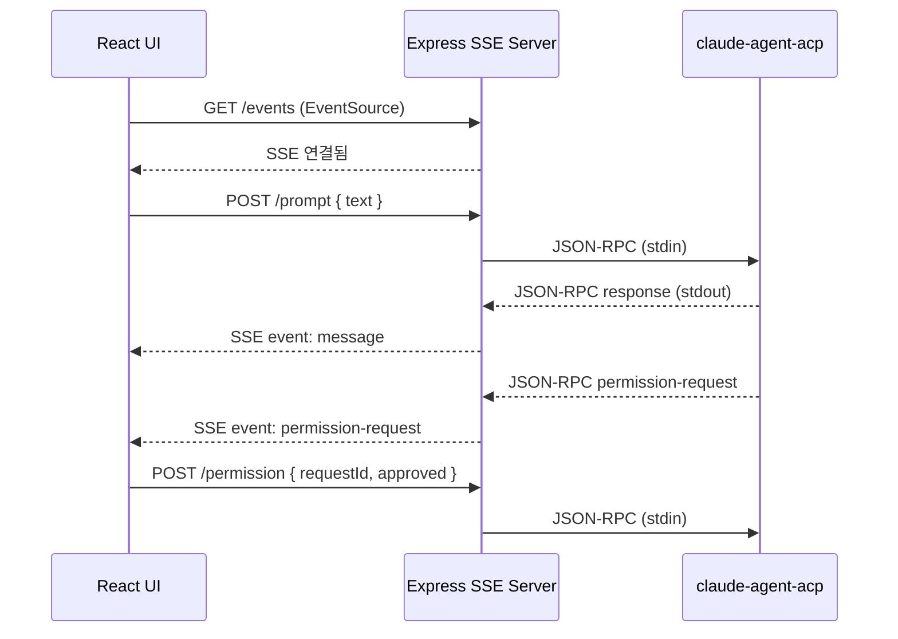

# Design: cline-acp-sse

## 시스템 경계



## 컴포넌트

### agent (Node.js + TypeScript, Express)

#### bridge.ts
- 역할: ACP 에이전트 프로세스 lifecycle 관리 + JSON-RPC 통신
- 책임: spawn/kill, stdin 쓰기, stdout 파싱, 이벤트 emit
- 인터페이스:
  - `class ACPBridge extends EventEmitter`
  - `start(): void` — 에이전트 프로세스 시작
  - `stop(): void` — 에이전트 프로세스 종료
  - `sendPrompt(text: string): void`
  - `sendPermission(requestId: string, approved: boolean): void`
  - Events: `message`, `toolcall`, `permission-request`, `error`, `exit`

#### server.ts
- 역할: Express HTTP 서버, SSE 스트림, REST 엔드포인트
- 책임: 클라이언트 연결 관리, SSE 브로드캐스트, keepalive
- 인터페이스:
  - `GET /events` → SSE stream
  - `POST /prompt` → { text: string }
  - `POST /permission` → { approved: boolean, requestId: string }
  - `GET /health` → { status: "ok" }

### ui (React 19 + Vite, 포트 5174)

#### useChat.ts (hook)
- 역할: SSE 연결 및 서버 통신 상태 관리
- 책임: EventSource 연결, fetch POST, 메시지/툴콜/권한요청 상태 관리
- 인터페이스:
  - `messages: Message[]`
  - `toolCalls: ToolCall[]`
  - `permissionRequest: PermissionRequest | null`
  - `connected: boolean`
  - `sendPrompt(text: string): Promise<void>`
  - `respondPermission(requestId: string, approved: boolean): Promise<void>`

## 데이터 모델

```typescript
type Message = {
  id: string;
  role: "user" | "agent";
  content: string;
  timestamp: number;
}

type ToolCall = {
  id: string;
  name: string;
  params: Record<string, unknown>;
  timestamp: number;
}

type PermissionRequest = {
  requestId: string;
  description: string;
  tool: string;
}
```

## 시퀀스 다이어그램



## 기술 결정

| 결정 | 선택 | 이유 |
|------|------|------|
| 실시간 통신 | SSE (EventSource) | 단방향 스트리밍에 최적, 자동 재연결, 방화벽 친화적 |
| 에이전트 통신 | stdio JSON-RPC | ACP SDK 표준 인터페이스 |
| 빌드 도구 | Vite | React 19 + TypeScript 빠른 HMR |
| 컨테이너 | Docker Compose | 두 서비스 동시 관리 |

## 의존성 방향

```
UI → Server (HTTP)
Server → ACPBridge (함수 호출)
ACPBridge → claude-agent-acp (stdio)
```
