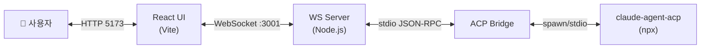
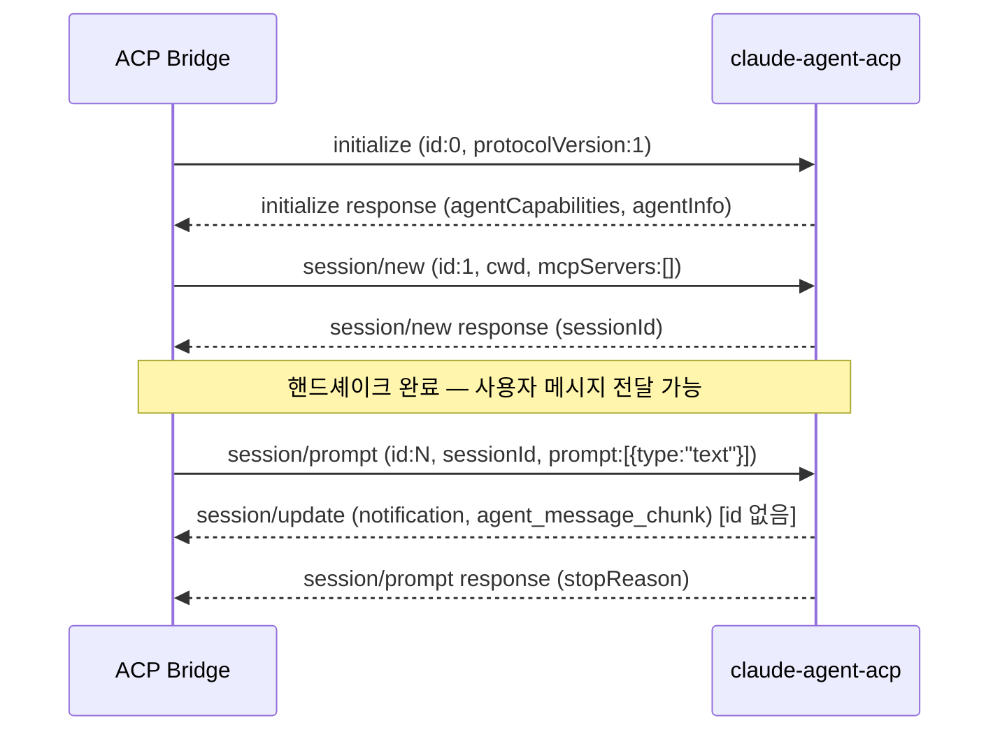
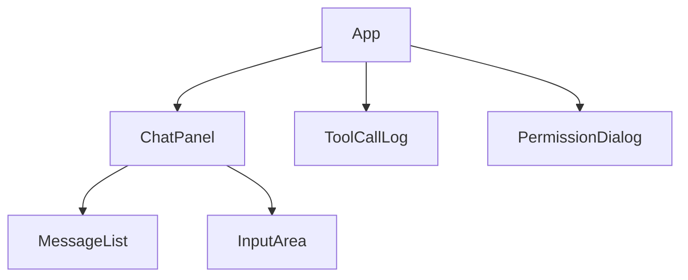
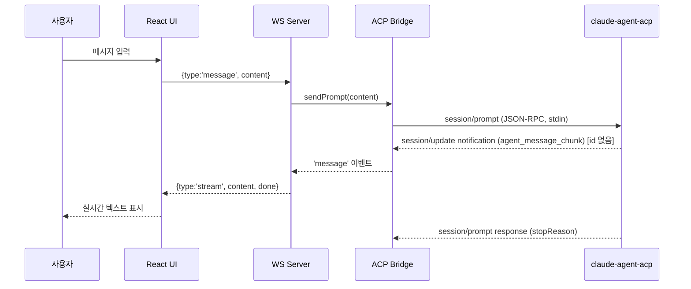
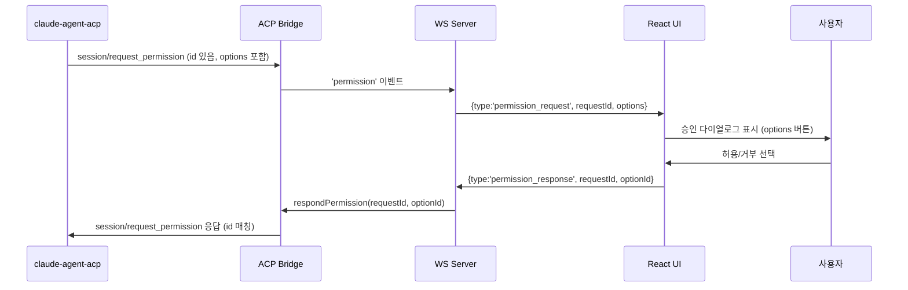

# Design: cline-acp-ws-v2

> 스티어링 정렬 검증: tech/structure 스티어링과 일치함 ✅
> 참조: references/acp-protocol.md

---

## 시스템 아키텍처



---

## ACP 프로토콜 핸드셰이크 시퀀스

> 참조: references/acp-protocol.md — 실제 메서드명 및 순서



---

## 컴포넌트 설계

### 1. ACP Bridge (`agent/src/bridge.ts`)

**역할**: ACP 에이전트 프로세스 라이프사이클 관리 및 stdio 통신

> 참조: references/acp-protocol.md — 정확한 메서드명 사용 필수

**인터페이스**:
```
class AcpBridge extends EventEmitter
  constructor(workDir: string)
  start(): Promise<void>      // spawn 후 initialize → session/new 핸드셰이크
  stop(): Promise<void>
  sendPrompt(content: string): void    // session/prompt 전송
  respondPermission(requestId: number, optionId: string): void  // session/request_permission 응답

Events:
  'ready'       → void                    // 핸드셰이크 완료
  'message'     → { type: 'text'|'stream', content: string, done?: boolean }
  'toolcall'    → { id: string, name: string, kind: string, status: 'pending'|'in_progress'|'completed'|'failed' }
  'permission'  → { requestId: number, toolCallId: string, options: PermissionOption[] }
  'error'       → Error
  'exit'        → { code: number }
```

**내부 구현 요구사항** (references/acp-protocol.md 기반):
- readline으로 stdout 줄 단위 파싱
- `id` 없는 메시지 = Notification (`session/update`, `session/cancel`)
- `id` 있고 `method` 있는 메시지 = Request (`session/request_permission`)
- `id` 있고 `result`/`error` 있는 메시지 = Response
- 요청 ID 카운터 관리 (0: initialize, 1: session/new, 2+: session/prompt)

**의존성**: `child_process.spawn`, `readline`

---

### 2. WebSocket Server (`agent/src/server.ts`)

**역할**: WebSocket 연결 관리, Bridge 이벤트 → WebSocket 메시지 변환

**메시지 프로토콜 (클라이언트 → 서버)**:
```
{ type: 'message', content: string }
{ type: 'permission_response', requestId: number, optionId: string }
```

**메시지 프로토콜 (서버 → 클라이언트)**:
```
{ type: 'message', role: 'user'|'agent', content: string }
{ type: 'stream', content: string, done: boolean }
{ type: 'toolcall', id: string, name: string, kind: string, status: string }
{ type: 'permission_request', requestId: number, toolCallId: string, options: PermissionOption[] }
{ type: 'error', message: string }
{ type: 'agent_ready' }
{ type: 'agent_exit', code: number }
```

**제약**: 단일 연결 - 두 번째 클라이언트는 `{ type: 'error', message: '이미 세션이 진행 중입니다' }` 후 종료

---

### 3. React UI (`ui/src/`)



**컴포넌트 책임**:

| 컴포넌트 | 책임 |
|----------|------|
| `App.tsx` | WebSocket 연결, 전역 상태 |
| `useChat.ts` | WebSocket 클라이언트 훅, 메시지 상태 |
| `MessageList.tsx` | 채팅 메시지 렌더링 |
| `ChatPanel.tsx` | 입력창 + MessageList 레이아웃 |
| `PermissionDialog.tsx` | 파일 권한 승인 모달 (options 배열 표시) |
| `ToolCallLog.tsx` | 툴콜 이벤트 로그 목록 |

**useChat 훅 인터페이스**:
```
interface UseChatReturn {
  messages: Message[]
  toolCalls: ToolCall[]
  permissionRequest: PermissionRequest | null
  isConnected: boolean
  isAgentReady: boolean
  sendMessage(content: string): void
  respondPermission(requestId: number, optionId: string): void
}
```

---

## 데이터 모델

```typescript
interface Message {
  id: string
  role: 'user' | 'agent'
  content: string
  streaming?: boolean
  timestamp: number
}

interface ToolCall {
  id: string
  name: string        // toolCallId
  kind: string        // read | edit | delete | execute | other
  status: 'pending' | 'in_progress' | 'completed' | 'failed'
  timestamp: number
}

interface PermissionOption {
  optionId: string
  name: string
  kind: 'allow_once' | 'allow_always' | 'reject_once' | 'reject_always'
}

interface PermissionRequest {
  requestId: number
  toolCallId: string
  options: PermissionOption[]
}
```

---

## 시퀀스: 사용자 메시지 → 에이전트 응답



---

## 시퀀스: Human-in-the-Loop



---

## 기술 결정

| 결정 | 선택 | 이유 |
|------|------|------|
| ACP 통신 | stdio (readline) | 에이전트가 로컬 프로세스 |
| stdout 파싱 | readline (줄 단위) | JSON-RPC over stdio = 줄 단위 메시지 |
| 알림 판별 | id 필드 없음 여부 | JSON-RPC 2.0 표준 |
| 핸드셰이크 | initialize→session/new 필수 | ACP 스펙 MUST 요건 |
