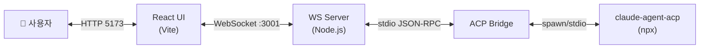
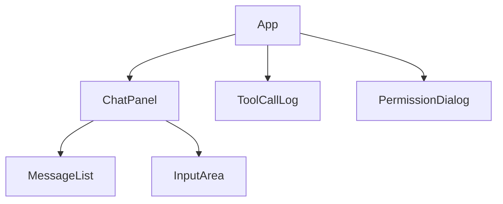
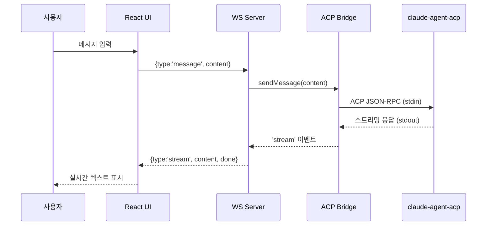
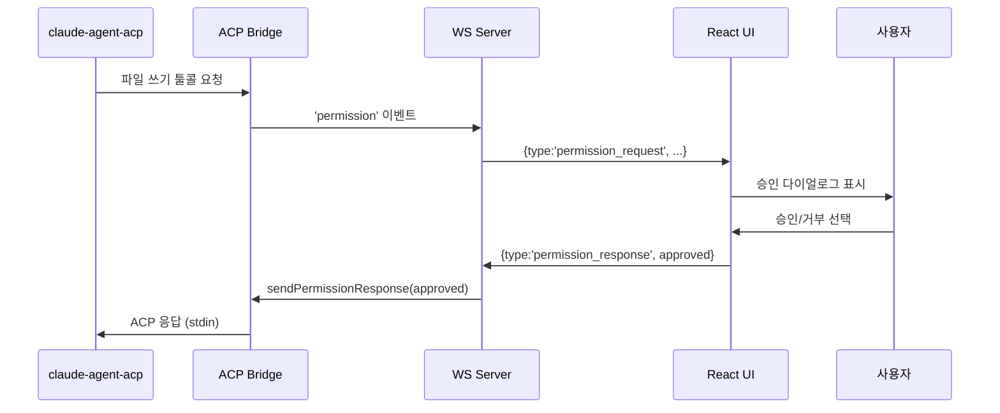

# Design: cline-acp-ws

> 스티어링 정렬 검증: tech/structure 스티어링과 일치함 ✅

---

## 시스템 아키텍처



---

## 컴포넌트 설계

### 1. ACP Bridge (`agent/src/bridge.ts`)

**역할**: ACP 에이전트 프로세스 라이프사이클 관리 및 stdio 통신

**인터페이스**:
```
class AcpBridge extends EventEmitter
  constructor(workDir: string)
  start(): Promise<void>
  stop(): Promise<void>
  sendMessage(content: string): void
  sendPermissionResponse(approved: boolean, requestId: string): void

Events:
  'message'     → { type: 'text'|'stream', content: string, done?: boolean }
  'toolcall'    → { id: string, name: string, args: object, status: 'start'|'done'|'error', result?: string }
  'permission'  → { requestId: string, filePath: string, operation: 'write'|'delete' }
  'error'       → Error
  'exit'        → { code: number }
```

**의존성**: `child_process.spawn`, `@agentclientprotocol/sdk`

---

### 2. WebSocket Server (`agent/src/server.ts`)

**역할**: WebSocket 연결 관리, Bridge 이벤트 → WebSocket 메시지 변환

**메시지 프로토콜 (클라이언트 → 서버)**:
```
{ type: 'message', content: string }
{ type: 'permission_response', requestId: string, approved: boolean }
```

**메시지 프로토콜 (서버 → 클라이언트)**:
```
{ type: 'message', role: 'user'|'agent', content: string }
{ type: 'stream', content: string, done: boolean }
{ type: 'toolcall', id: string, name: string, args: object, status: string, result?: string }
{ type: 'permission_request', requestId: string, filePath: string, operation: string }
{ type: 'error', message: string }
{ type: 'agent_ready' }
{ type: 'agent_exit', code: number }
```

**제약**: 단일 연결 - 두 번째 클라이언트는 `{ type: 'error', message: '이미 세션이 진행 중입니다' }` 후 종료

---

### 3. React UI (`ui/src/`)



**컴포넌트 책임**:

| 컴포넌트 | 책임 |
|----------|------|
| `App.tsx` | WebSocket 연결, 전역 상태 |
| `useChat.ts` | WebSocket 클라이언트 훅, 메시지 상태 |
| `MessageList.tsx` | 채팅 메시지 렌더링 |
| `ChatPanel.tsx` | 입력창 + MessageList 레이아웃 |
| `PermissionDialog.tsx` | 파일 권한 승인 모달 |
| `ToolCallLog.tsx` | 툴콜 이벤트 로그 목록 |

**useChat 훅 인터페이스**:
```
interface UseChatReturn {
  messages: Message[]
  toolCalls: ToolCall[]
  permissionRequest: PermissionRequest | null
  isConnected: boolean
  isAgentReady: boolean
  sendMessage(content: string): void
  respondPermission(approved: boolean): void
}
```

---

## 데이터 모델

```typescript
interface Message {
  id: string
  role: 'user' | 'agent'
  content: string
  streaming?: boolean
  timestamp: number
}

interface ToolCall {
  id: string
  name: string
  args: object
  status: 'running' | 'done' | 'error'
  result?: string
  timestamp: number
}

interface PermissionRequest {
  requestId: string
  filePath: string
  operation: 'write' | 'delete'
}
```

---

## 시퀀스: 사용자 메시지 → 에이전트 응답



---

## 시퀀스: Human-in-the-Loop


