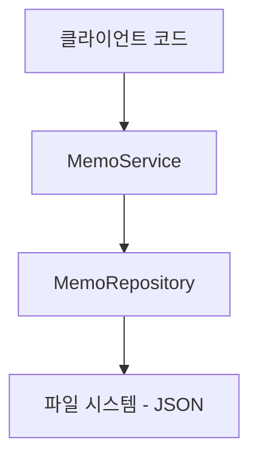
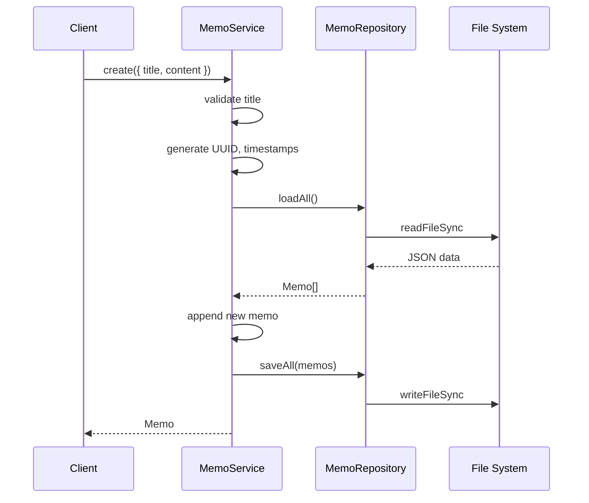

# 설계: memo-crud

## 개요

3-레이어 아키텍처(Model → Repository → Service)로 메모 CRUD를 구현한다. 로컬 JSON 파일 기반 영속성.

## 아키텍처

### 시스템 경계

- 입력: 프로그래밍 API (함수 호출)
- 출력: Memo 객체 또는 배열
- 외부 의존: 로컬 파일 시스템 (Node.js fs 모듈)

### 주요 컴포넌트

의존성 방향: Service → Repository → Model (단방향)

## 컴포넌트 상세

### Memo (Model)
- **역할**: 메모 데이터 타입 정의
- **출력**: Memo 타입, CreateMemoInput 타입, UpdateMemoInput 타입

### MemoRepository
- **역할**: JSON 파일 읽기/쓰기, 데이터 영속화
- **입력**: Memo 배열
- **출력**: Memo 배열
- **의존성**: Node.js fs, path 모듈

### MemoService
- **역할**: CRUD 비즈니스 로직, 유효성 검증, UUID 생성, 타임스탬프 관리
- **입력**: CreateMemoInput, UpdateMemoInput, id
- **출력**: Memo, Memo[], boolean, null
- **의존성**: MemoRepository

## 데이터 모델

### Memo
| 필드 | 타입 | 설명 | 제약 |
|------|------|------|------|
| id | string | UUID v4 고유 식별자 | 필수, 자동 생성 |
| title | string | 메모 제목 | 필수, 빈 문자열 불가 |
| content | string | 메모 본문 | 필수, 빈 문자열 허용 |
| createdAt | string | 생성 시각 (ISO 8601) | 필수, 자동 생성 |
| updatedAt | string | 수정 시각 (ISO 8601) | 필수, 자동 갱신 |

### CreateMemoInput
| 필드 | 타입 | 설명 |
|------|------|------|
| title | string | 메모 제목 |
| content | string | 메모 본문 |

### UpdateMemoInput
| 필드 | 타입 | 설명 |
|------|------|------|
| title? | string | 변경할 제목 (선택) |
| content? | string | 변경할 본문 (선택) |

## API 계약

### MemoRepository
- **loadAll(): Memo[]** — JSON 파일에서 전체 메모 로드. 파일 없으면 빈 배열 반환.
- **saveAll(memos: Memo[]): void** — 전체 메모 배열을 JSON 파일에 저장.

### MemoService
- **create(input: CreateMemoInput): Memo** — 새 메모 생성. title 빈 문자열 시 에러.
- **findAll(): Memo[]** — 전체 메모 조회.
- **findById(id: string): Memo | null** — ID로 메모 조회. 없으면 null.
- **update(id: string, input: UpdateMemoInput): Memo | null** — 메모 수정. 없으면 null.
- **remove(id: string): boolean** — 메모 삭제. 성공 true, 없으면 false.

## 흐름 다이어그램

## 기술 결정
| 결정 | 선택 | 이유 | 대안 |
|------|------|------|------|
| 데이터 저장 | 단일 JSON 파일 | 단순성, 외부 의존 없음 | SQLite (과도) |
| UUID 생성 | Node.js crypto.randomUUID() | 내장, 외부 패키지 불필요 | uuid 패키지 (불필요한 의존) |
| 파일 I/O | 동기(sync) | 단순한 CLI 앱, 비동기 불필요 | 비동기 fs (과도) |
