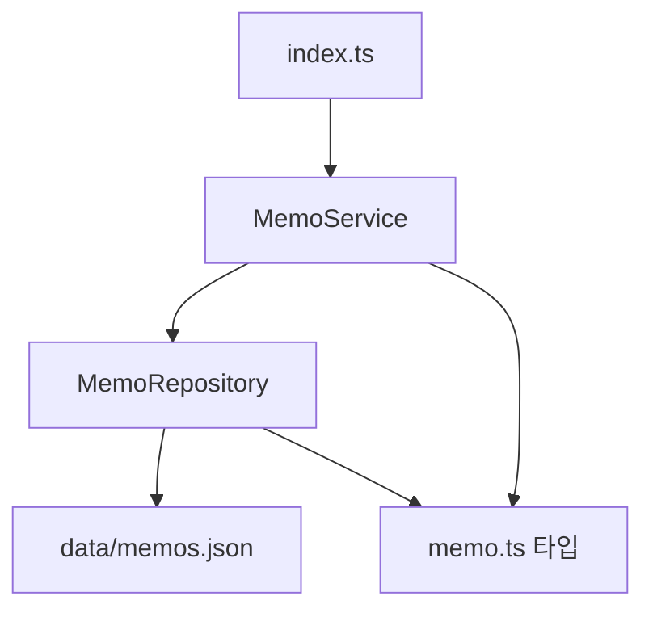
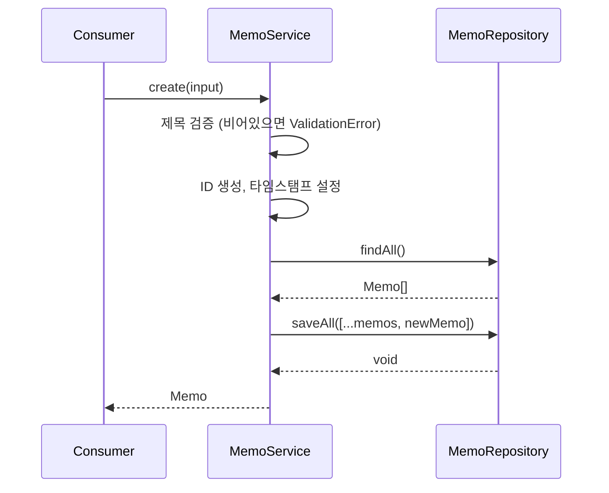
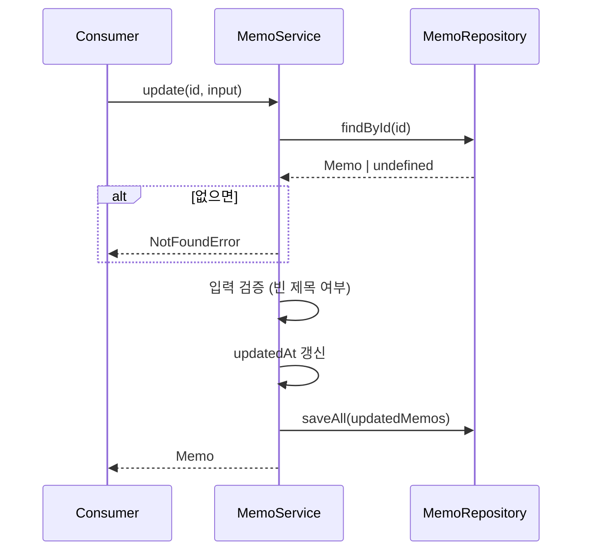

# Design: 메모 CRUD

Feature: `memo-crud`
Created: 2026-03-15

---

## 1. 시스템 경계

**내부**: MemoService, MemoRepository, Memo 타입
**외부**: Node.js 파일 시스템 (fs/promises), 소비자 코드 (index.ts)

외부 서비스 없음 — 로컬 JSON 파일 기반 영속성.

---

## 2. 아키텍처

계층형 아키텍처 (Layered Architecture):

```
Consumer (index.ts)
    ↓
MemoService        ← 비즈니스 로직, 입력 검증
    ↓
MemoRepository     ← 영속성 접근 (JSON 파일 I/O)
    ↓
data/memos.json    ← 영속성 파일
```

의존성 방향: 단방향 (Consumer → Service → Repository → FS)
순환 의존성 없음.

---

## 3. 컴포넌트

### 3.1 Memo 타입 (`src/memo/memo.ts`)
메모 도메인 타입 정의. 로직 없음.

- `Memo`: 완전한 메모 엔티티 (id, title, body, createdAt, updatedAt)
- `CreateMemoInput`: 생성 입력 (title, body)
- `UpdateMemoInput`: 수정 입력 (title?, body?)
- `MemoSummary`: 목록용 요약 (id, title, createdAt)

### 3.2 MemoRepository (`src/memo/memo.repository.ts`)
JSON 파일 읽기/쓰기 담당. 비즈니스 로직 없음.

책임:
- `data/memos.json` 초기화 (파일 없으면 빈 배열)
- 전체 메모 배열 로드/저장
- ID 기반 단건 조회

### 3.3 MemoService (`src/memo/memo.service.ts`)
비즈니스 로직 담당. 파일 I/O 직접 접근 없음.

책임:
- 입력 검증 (제목 비어있음 여부)
- ID 생성 (UUID 또는 타임스탬프 기반)
- 존재 여부 확인 및 오류 처리
- CRUD 오퍼레이션 조율

---

## 4. 인터페이스 계약

### 4.1 Memo 타입

```
interface Memo {
  id: string
  title: string
  body: string
  createdAt: string  // ISO 8601
  updatedAt: string  // ISO 8601
}

interface CreateMemoInput {
  title: string
  body: string
}

interface UpdateMemoInput {
  title?: string
  body?: string
}

interface MemoSummary {
  id: string
  title: string
  createdAt: string
}
```

### 4.2 MemoRepository 인터페이스

```
interface IMemoRepository {
  findAll(): Promise<Memo[]>
  findById(id: string): Promise<Memo | undefined>
  save(memo: Memo): Promise<void>
  saveAll(memos: Memo[]): Promise<void>
}
```

### 4.3 MemoService 인터페이스

```
interface IMemoService {
  create(input: CreateMemoInput): Promise<Memo>
  list(): Promise<MemoSummary[]>
  get(id: string): Promise<Memo>
  update(id: string, input: UpdateMemoInput): Promise<Memo>
  delete(id: string): Promise<void>
}
```

### 4.4 오류 타입

- `ValidationError`: 입력값 검증 실패 (빈 제목 등)
- `NotFoundError`: ID에 해당하는 메모 없음

---

## 5. 데이터 모델

### 5.1 Memo 엔티티

| 필드 | 타입 | 설명 |
|------|------|------|
| id | string | 고유 식별자 (UUID v4) |
| title | string | 제목 (1자 이상) |
| body | string | 본문 |
| createdAt | string | ISO 8601 생성 시각 |
| updatedAt | string | ISO 8601 최종 수정 시각 |

### 5.2 영속성 파일 (`data/memos.json`)

```
Memo[]  ← JSON 배열
```

파일 없으면 `[]`로 초기화.

---

## 6. 다이어그램

### 6.1 컴포넌트 의존성



### 6.2 메모 생성 흐름



### 6.3 메모 수정 흐름



---

## 7. 기술 결정

### ID 생성
- **선택**: `crypto.randomUUID()` (Node.js 내장, 추가 의존성 없음)
- **대안**: uuid 패키지 — 불필요한 외부 의존성 추가로 제외
- **트레이드오프**: Node.js 14.17+ 필요 (현재 환경에서 문제 없음)

### 영속성
- **선택**: JSON 파일 (`fs/promises`)
- **대안**: SQLite, LevelDB — MVP에 과함
- **트레이드오프**: 동시 쓰기 취약, 대용량 불리 — 단일 사용자 MVP에서 허용

### 오류 처리
- **선택**: 커스텀 Error 서브클래스 (`ValidationError`, `NotFoundError`)
- **대안**: 문자열 반환 — 타입 안전성 부족
- **트레이드오프**: 클래스 2개 추가 비용 vs 명확한 오류 분류

---

## 스티어링 정렬 검증

- ✅ TypeScript strict 모드 준수
- ✅ Jest + ts-jest 테스트 환경
- ✅ 외부 DB 없음 (로컬 JSON)
- ✅ feature-first 폴더 구조 (`src/memo/`)
- ✅ Service/Repository 계층 분리
- ✅ 불필요한 프레임워크 없음
