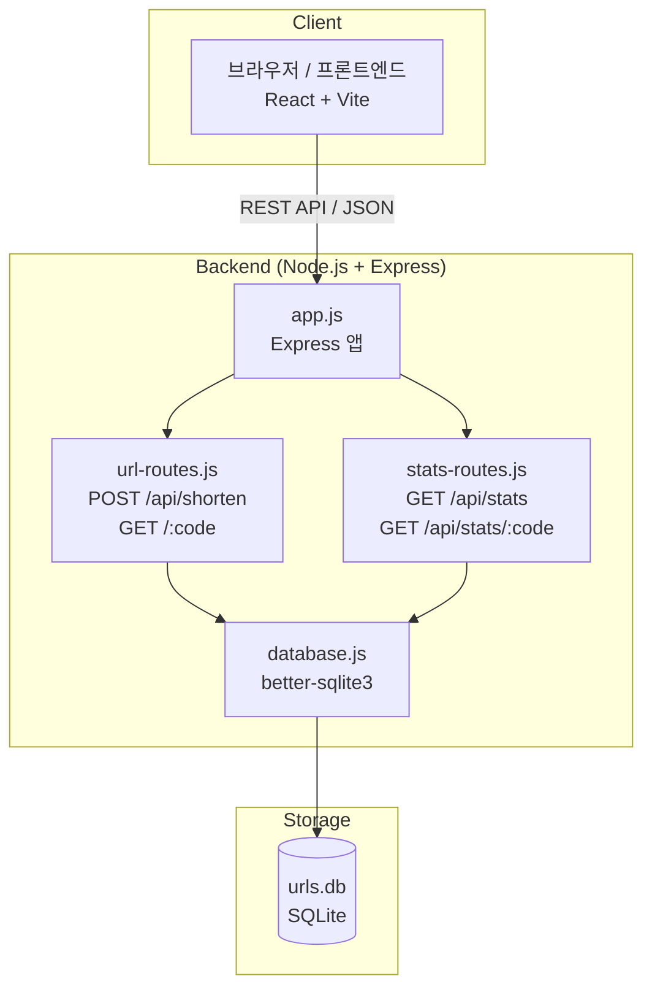
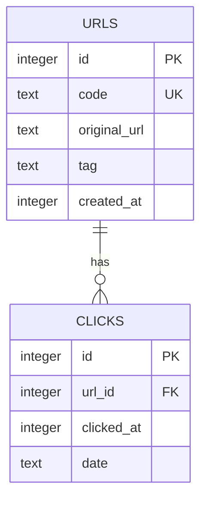
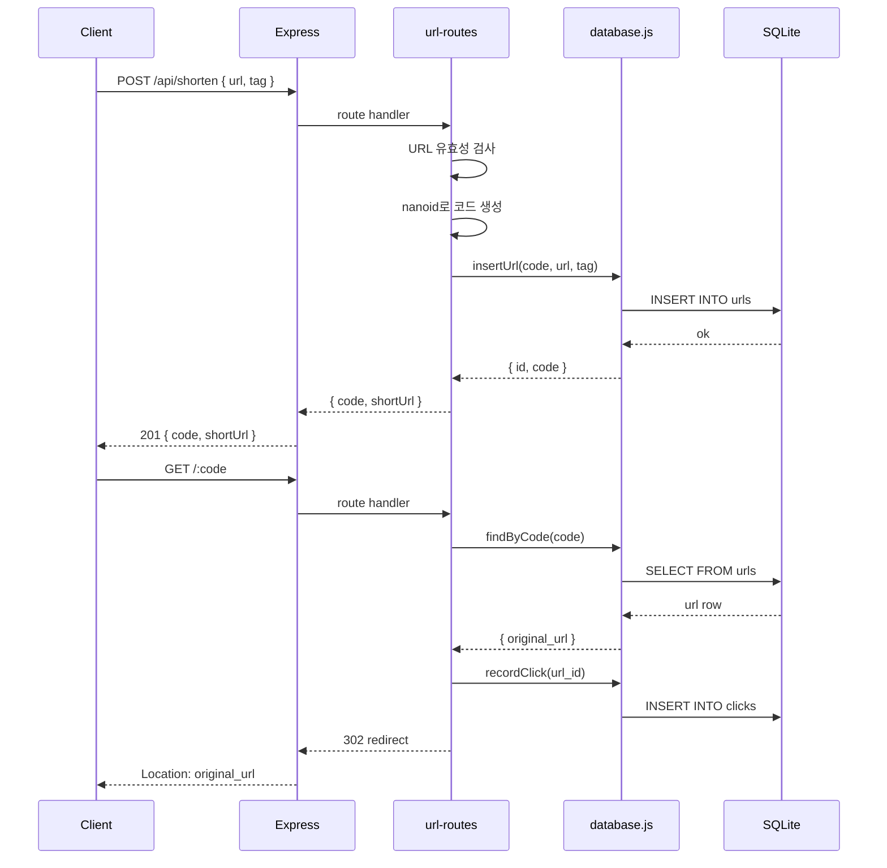
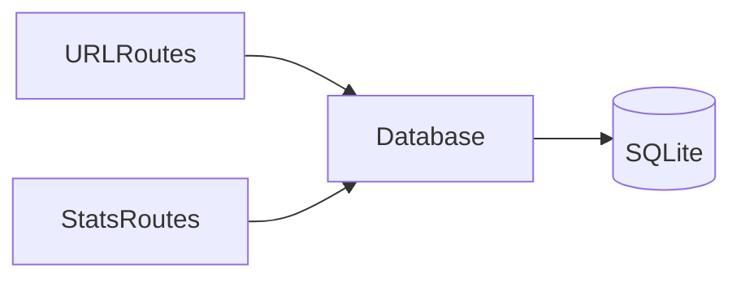

# 설계: URL 단축 서비스

> 스펙: 1773353840-url-shortener  
> 생성일: 2026-03-12T22:17:20Z  
> 기술 스티어링 정렬: tech.md ✅ | structure.md ✅

---

## 1. 시스템 경계



---

## 2. 주요 컴포넌트

### 2.1 Backend

| 컴포넌트 | 위치 | 역할 |
|----------|------|------|
| `app.js` | `backend/src/app.js` | Express 앱 초기화, 미들웨어 등록, 라우터 연결 |
| `database.js` | `backend/src/db/database.js` | SQLite 연결, 스키마 생성, DB 인스턴스 제공 |
| `url-routes.js` | `backend/src/routes/url-routes.js` | URL 단축 및 리다이렉트 엔드포인트 |
| `stats-routes.js` | `backend/src/routes/stats-routes.js` | 통계 조회 엔드포인트 |

### 2.2 Frontend

| 컴포넌트 | 위치 | 역할 |
|----------|------|------|
| `Dashboard.jsx` | `frontend/src/pages/Dashboard.jsx` | 메인 대시보드 페이지 |
| `ShortenForm.jsx` | `frontend/src/components/ShortenForm.jsx` | URL 입력 폼 |
| `UrlTable.jsx` | `frontend/src/components/UrlTable.jsx` | 단축 URL 목록 테이블 |
| `ClickChart.jsx` | `frontend/src/components/ClickChart.jsx` | 날짜별 클릭 차트 (Recharts) |
| `api.js` | `frontend/src/api/api.js` | API 호출 함수 모음 |

---

## 3. API 인터페이스 계약

### POST /api/shorten

**요청:**
```
Content-Type: application/json
{ "url": string (required), "tag": string (optional) }
```

**응답 (201):**
```
{ "code": string, "shortUrl": string, "tag": string|null }
```

**오류 (400):**
```
{ "error": string }
```

---

### GET /:code

**응답 (301/302):** Location 헤더로 원본 URL 리다이렉트  
**오류 (404):** `{ "error": "Not found" }`

---

### GET /api/stats

**응답 (200):**
```
[
  {
    "code": string,
    "originalUrl": string,
    "tag": string|null,
    "totalClicks": number,
    "createdAt": string (ISO 8601)
  }
]
```

---

### GET /api/stats/:code

**응답 (200):**
```
{
  "code": string,
  "originalUrl": string,
  "tag": string|null,
  "totalClicks": number,
  "createdAt": string,
  "dailyClicks": [
    { "date": string (YYYY-MM-DD), "clicks": number }
  ]
}
```

**오류 (404):** `{ "error": "Not found" }`

---

## 4. 데이터 모델



### 스키마 정의

**urls 테이블:**
- `id`: INTEGER PRIMARY KEY AUTOINCREMENT
- `code`: TEXT UNIQUE NOT NULL (nanoid 생성)
- `original_url`: TEXT NOT NULL
- `tag`: TEXT (nullable)
- `created_at`: INTEGER (Unix timestamp)

**clicks 테이블:**
- `id`: INTEGER PRIMARY KEY AUTOINCREMENT
- `url_id`: INTEGER NOT NULL REFERENCES urls(id)
- `clicked_at`: INTEGER (Unix timestamp)
- `date`: TEXT (YYYY-MM-DD, 날짜별 집계용)

---

## 5. API 흐름



---

## 6. 의존성 방향



**Backend 의존성 규칙:**
- routes → db (단방향, 스티어링 준수)
- db → SQLite (단방향)
- 역방향 금지

---

## 7. 기술 결정 기록

| 결정 | 선택 | 이유 | 제외된 대안 |
|------|------|------|-------------|
| 코드 생성 | nanoid | 충돌 없음, URL-safe | uuid (너무 김), random (충돌 가능) |
| DB | SQLite / better-sqlite3 | 설정 없는 파일 기반 | PostgreSQL (설정 복잡), MySQL (동일) |
| 코드 길이 | 8자 | 충돌 확률 극히 낮음, 짧음 | 6자 (더 짧지만 충돌↑), 12자 (너무 김) |
| 통계 저장 | 클릭마다 행 삽입 | 날짜별 집계 유연 | 카운터만 (날짜별 집계 불가) |

---

## 8. 트레이드오프 및 제약

- **SQLite 동시성**: 단일 쓰기 잠금이나 MVP에서 충분
- **클릭 기록 지연 없음**: 동기 방식으로 즉시 반영 (요구사항 2.2)
- **인증 없음**: MVP 공개 API (요구사항 외)
